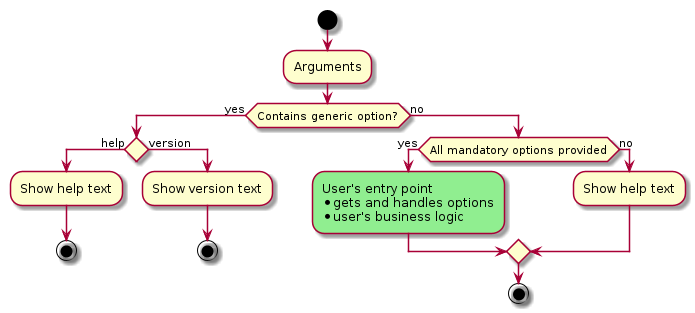

Utility library for simplifying using of `Boost::program_options` where user can concentrate not on options/arguments configuration but on usage of them.

## Build Status
[](https://github.com/nkh-lab/prog-arg-manager/actions/workflows/ci.yml)

## Dependencies
* [Boost::program_options](https://github.com/boostorg/program_options)
* [GTest (for unit tests build only)](https://github.com/google/googletest)

## How it works

All options are devided to three categories:
1. Generic: hardcoded `help` and `version` options.
2. Optional: user defined.
3. Mandatory: user defined.

The following diagram shows the arguments handling logic:



## Usage

This project contains a simple example of how to use the library that covers the basic cases of options/arguments usage.

Example source code: [test/component_test/main.cpp](test/component_test/main.cpp)

### How to build example

```
$ mkdir build && cd build
$ cmake -Dprog-arg-manager_BUILD_TESTS=on ..
$ make
```

Executable binary `prog-arg-manager-ctest` is here:
```
$ cd build/test/component_test
```

### How to run example

Run example without all mandatory options or with "-h [ --help ]", help text should be shown:
```
$ ./prog-arg-manager-ctest -h
Allowed options:

Generic:
  -h [ --help ]          display this help text and exit
  -v [ --version ]       display version information and exit

Optional:
  --num arg              to test numeric arguments
  -r [ --read ]          read flag to test boolean
  -w [ --write ]         write flag to test boolean
  -d [ --delete ]        delete flag to test boolean

Mandatory (last option name can be omitted):
  -p [ --path ] arg      path to test string
  -f [ --files ] arg     files to test vector<string>
```

Run example with "-v [ --version ]" to show version:
```
$ ./prog-arg-manager-ctest -v
1.0.0
```

Run example with all mandatory options:
```
$ ./prog-arg-manager-ctest --num 789 -rw -p /path/to/my/dir file1.txt file2.txt file3.txt
num:   789
read:  1
write: 1
del:   0
path:  /path/to/my/dir
files: 
       file1.txt
       file2.txt
       file3.txt
```
